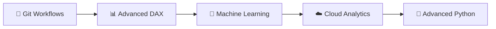

# <div align="center"></div>

<p align="center">
  
</p>


## <div align="center">🚀 **About Me** 🚀</div>

<div align="center">
  
```python
class TinaPaolaVarela:
    def __init__(self):
        self.name = "Tina Paola Varela"
        self.location = "Colombia 🇨🇴"
        self.role = "Junior Data Analyst"
        self.passion = "Transforming data into actionable insights"
        self.education = ["Keycode Bootcamp", "Talento Tech"]
        self.languages = ["Spanish", "English"]
        self.hobbies = ["🧁 Baking", "🎨 Art", "🤘 Metal Music", "🌲 Nature"]
    
    def current_focus(self):
        return [
            "📊 Building interactive dashboards",
            "🐍 Mastering Python for data science",  
            "📈 Learning advanced DAX measures",
            "🤝 Contributing to open source projects"
        ]

me = TinaPaolaVarela()
print("¡Hola! Let's explore the world of data together! 🌟")
```

</div>

---

## <div align="center">🛠️ **Tech Arsenal** 🛠️</div>

<div align="center">

### Programming & Analysis


### Visualization & BI


### Tools & Platforms


</div>

---

## <div align="center">💼 **What I Do** 💼</div>

<div align="center">
  
| 🔍 **Data Exploration** | 🧹 **Data Cleaning** | 📊 **Visualization** | 📈 **Statistical Analysis** |
|:---:|:---:|:---:|:---:|
| Transform raw data into meaningful insights | Prepare datasets for optimal analysis | Create interactive dashboards | Extract patterns and trends |

</div>

<div align="center">
  
</div>

---

## <div align="center">🌱 **Currently Learning** 🌱</div>

<div align="center">
  

```mermaid
graph LR
    A[🔄 Git Workflows] --> B[📊 Advanced DAX]
    B --> C[🤖 Machine Learning]
    C --> D[☁️ Cloud Analytics]
    D --> E[🎯 Advanced Python]
```

</div>

---

## <div align="center">🤝 **Let's Connect** 🤝</div>

<div align="center">
  
[](mailto:tinapaolavarela@gmail.com)
[](https://github.com/tinapavare)
[](#)

</div>

---

## <div align="center">📊 **GitHub Analytics** 📊</div>

<div align="center">
  
[](https://github.com/tinapavare)

[](https://github.com/tinapavare)

[](https://github.com/tinapavare)

</div>

<div align="center">
  
### 📈 **Activity Graph**
[](https://github.com/tinapavare)

</div>

---

## <div align="center">🎯 **Fun Facts About Me** 🎯</div>

<div align="center">

```
🧁 I bake the most delicious cakes while debugging code
🎨 My art skills help me create beautiful data visualizations  
🤘 Brutal Death Metal fuels my coding sessions
🌲 Nature walks inspire my best analytical insights
☕ Coffee + Data = Perfect combination
```

</div>

---

<div align="center">
  
### 💭 *"Data is not just numbers, it's stories waiting to be told"* 💭


**⭐ Don't forget to star my repositories if you find them interesting! ⭐**

</div>

<div align="center">
  
</div>
